# Mini Exchange Database ER Diagram

## 完整實體關係圖

```mermaid
erDiagram
    %% 用戶認證域 (Auth Domain)
    users {
        bigint id PK
        uuid uuid UK
        varchar username UK
        varchar email UK
        varchar password_hash
        varchar phone
        varchar first_name
        varchar last_name
        varchar status
        integer kyc_level
        timestamp last_login_at
        timestamp created_at
        timestamp updated_at
        integer version
    }
    
    roles {
        serial id PK
        varchar name UK
        text description
        timestamp created_at
    }
    
    permissions {
        serial id PK
        varchar name UK
        varchar resource
        varchar action
        text description
        timestamp created_at
    }
    
    user_roles {
        bigint user_id PK,FK
        integer role_id PK,FK
        timestamp created_at
    }
    
    role_permissions {
        integer role_id PK,FK
        integer permission_id PK,FK
        timestamp created_at
    }
    
    kyc_records {
        bigserial id PK
        bigint user_id FK
        integer level
        varchar status
        varchar document_type
        varchar document_number
        timestamp submitted_at
        timestamp reviewed_at
        bigint reviewed_by FK
        text notes
        timestamp created_at
    }

    %% 資產管理域 (Asset Domain)
    assets {
        serial id PK
        varchar symbol UK
        varchar name
        varchar type
        integer decimals
        boolean is_active
        decimal min_withdraw_amount
        decimal max_withdraw_amount
        decimal withdraw_fee
        decimal deposit_fee
        timestamp created_at
        timestamp updated_at
    }
    
    accounts {
        bigserial id PK
        bigint user_id FK
        integer asset_id FK
        decimal available_balance
        decimal frozen_balance
        decimal total_balance
        bigint last_transaction_id
        timestamp created_at
        timestamp updated_at
        integer version
    }
    
    transactions {
        bigserial id PK
        uuid uuid UK
        bigint user_id FK
        integer asset_id FK
        varchar type
        decimal amount
        decimal balance_before
        decimal balance_after
        varchar reference_type
        bigint reference_id
        text description
        timestamp created_at
        bigint created_by FK
    }
    
    balance_freezes {
        bigserial id PK
        bigint account_id FK
        decimal amount
        varchar type
        bigint reference_id
        varchar status
        timestamp expires_at
        timestamp created_at
        timestamp released_at
    }
    
    deposit_withdrawals {
        bigserial id PK
        uuid uuid UK
        bigint user_id FK
        integer asset_id FK
        varchar type
        decimal amount
        decimal fee
        decimal net_amount
        varchar status
        varchar address
        varchar tx_hash
        integer confirmations
        integer required_confirmations
        timestamp processed_at
        timestamp created_at
        timestamp updated_at
    }

    %% 訂單管理域 (Order Domain)
    trading_pairs {
        serial id PK
        varchar symbol UK
        integer base_asset_id FK
        integer quote_asset_id FK
        varchar status
        decimal min_order_amount
        decimal max_order_amount
        decimal min_price
        decimal max_price
        integer price_precision
        integer amount_precision
        decimal taker_fee_rate
        decimal maker_fee_rate
        timestamp created_at
        timestamp updated_at
    }
    
    orders {
        bigserial id PK
        uuid uuid UK
        bigint user_id FK
        integer trading_pair_id FK
        varchar type
        varchar side
        decimal amount
        decimal price
        decimal filled_amount
        decimal remaining_amount
        decimal avg_price
        varchar status
        varchar time_in_force
        decimal stop_price
        decimal fee_paid
        integer fee_asset_id FK
        varchar client_order_id
        timestamp created_at
        timestamp updated_at
        timestamp filled_at
        timestamp cancelled_at
        integer version
    }
    
    trades {
        bigserial id PK
        uuid uuid UK
        integer trading_pair_id FK
        bigint buyer_order_id FK
        bigint seller_order_id FK
        bigint buyer_user_id FK
        bigint seller_user_id FK
        decimal price
        decimal amount
        decimal buyer_fee
        decimal seller_fee
        integer buyer_fee_asset_id FK
        integer seller_fee_asset_id FK
        boolean is_maker_buyer
        timestamp created_at
    }

    %% 市場數據域 (Market Data Domain)
    klines {
        bigserial id PK
        integer trading_pair_id FK
        varchar interval
        timestamp open_time
        timestamp close_time
        decimal open_price
        decimal high_price
        decimal low_price
        decimal close_price
        decimal volume
        decimal quote_volume
        integer trades_count
        timestamp created_at
    }
    
    ticker_24hr {
        integer trading_pair_id PK,FK
        decimal open_price
        decimal high_price
        decimal low_price
        decimal close_price
        decimal volume
        decimal quote_volume
        decimal price_change
        decimal price_change_percent
        integer trades_count
        timestamp updated_at
    }

    %% 風控域 (Risk Domain)
    risk_rules {
        serial id PK
        varchar name
        varchar type
        jsonb conditions
        jsonb actions
        boolean is_active
        integer priority
        timestamp created_at
        timestamp updated_at
    }
    
    risk_events {
        bigserial id PK
        bigint user_id FK
        integer rule_id FK
        varchar type
        varchar level
        jsonb details
        varchar status
        timestamp resolved_at
        bigint resolved_by FK
        timestamp created_at
    }

    %% 清算結算域 (Settlement Domain)
    settlement_batches {
        bigserial id PK
        date batch_date UK
        varchar status
        integer total_trades
        decimal total_volume
        timestamp started_at
        timestamp completed_at
        timestamp created_at
    }
    
    settlement_details {
        bigserial id PK
        bigint batch_id FK
        bigint user_id FK
        integer asset_id FK
        decimal trade_amount
        decimal fee_amount
        decimal net_amount
        timestamp created_at
    }

    %% 通知域 (Notification Domain)
    notification_templates {
        serial id PK
        varchar name UK
        varchar type
        varchar title
        text content
        jsonb variables
        boolean is_active
        timestamp created_at
    }
    
    notifications {
        bigserial id PK
        bigint user_id FK
        integer template_id FK
        varchar type
        varchar title
        text content
        varchar status
        timestamp sent_at
        timestamp read_at
        timestamp created_at
    }

    %% 事件域 (Event Domain)
    outbox_events {
        bigserial id PK
        varchar aggregate_type
        varchar aggregate_id
        varchar event_type
        jsonb event_data
        uuid correlation_id
        uuid causation_id
        timestamp created_at
        timestamp processed_at
        varchar status
    }

    %% 審計域 (Audit Domain)
    audit_logs {
        bigserial id PK
        bigint user_id FK
        varchar action
        varchar resource_type
        varchar resource_id
        jsonb old_values
        jsonb new_values
        inet ip_address
        text user_agent
        timestamp created_at
    }

    %% 關係定義
    users ||--o{ user_roles : "has"
    roles ||--o{ user_roles : "assigned to"
    roles ||--o{ role_permissions : "has"
    permissions ||--o{ role_permissions : "granted to"
    users ||--o{ kyc_records : "submits"
    users ||--o{ kyc_records : "reviews"
    
    users ||--o{ accounts : "owns"
    assets ||--o{ accounts : "denominated in"
    accounts ||--o{ balance_freezes : "has"
    users ||--o{ transactions : "executes"
    assets ||--o{ transactions : "involves"
    users ||--o{ transactions : "created by"
    users ||--o{ deposit_withdrawals : "initiates"
    assets ||--o{ deposit_withdrawals : "involves"
    
    assets ||--o{ trading_pairs : "base asset"
    assets ||--o{ trading_pairs : "quote asset"
    users ||--o{ orders : "places"
    trading_pairs ||--o{ orders : "for"
    assets ||--o{ orders : "fee asset"
    trading_pairs ||--o{ trades : "executed on"
    orders ||--o{ trades : "buyer order"
    orders ||--o{ trades : "seller order"
    users ||--o{ trades : "buyer"
    users ||--o{ trades : "seller"
    assets ||--o{ trades : "buyer fee asset"
    assets ||--o{ trades : "seller fee asset"
    
    trading_pairs ||--o{ klines : "generates"
    trading_pairs ||--|| ticker_24hr : "summarized by"
    
    users ||--o{ risk_events : "triggers"
    risk_rules ||--o{ risk_events : "matches"
    users ||--o{ risk_events : "resolves"
    
    settlement_batches ||--o{ settlement_details : "contains"
    users ||--o{ settlement_details : "involves"
    assets ||--o{ settlement_details : "denominated in"
    
    users ||--o{ notifications : "receives"
    notification_templates ||--o{ notifications : "uses"
    
    users ||--o{ audit_logs : "performs"
```

## 核心業務流程圖

### 1. 訂單處理流程

### 2. 資金管理流程

### 3. 風控處理流程

## 數據流向圖

這個完整的數據庫設計為 mini-exchange-backend 提供了：

1. **完整的業務域覆蓋**: 從用戶管理到交易執行的全流程支持
2. **高性能架構**: 分區表、索引優化、緩存策略
3. **數據一致性**: 事務支持、約束檢查、審計追蹤
4. **可擴展性**: 模塊化設計、事件驅動架構
5. **安全性**: 權限控制、風控系統、加密存儲

